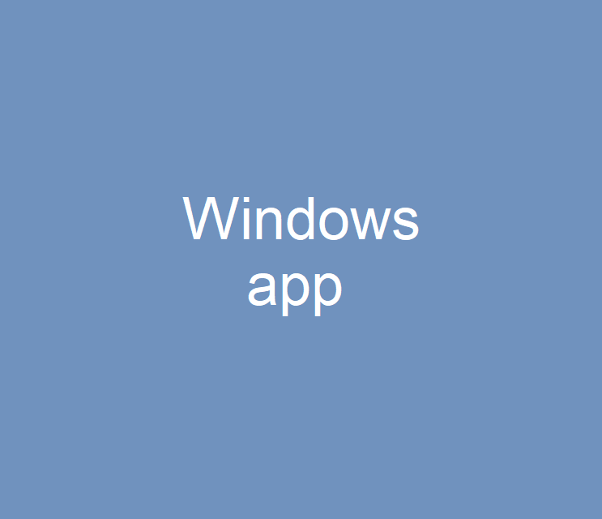

LOG3900 -- Team #6
==================

## Demo

## Description

Cross-platform (multiplayer) drawing and guessing game for Windows and Android using C# (WPF), Kotlin, NodeJS, MongoDB and more.

The game consists of guessing what the other player draw. Can be played in teams or alone versus a bot.

## Authors

Sami Tamer Arar,
Mohamed Amine Kamal,
Bassam Ajam,
Syphax Ait Yahia,
Georges Louis
